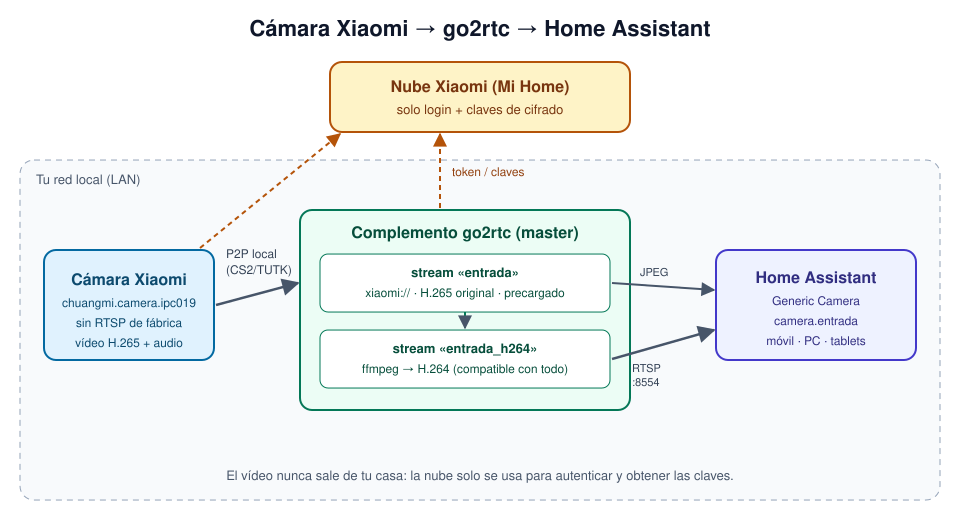
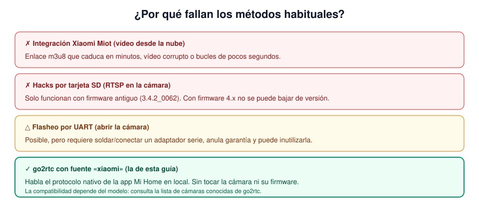
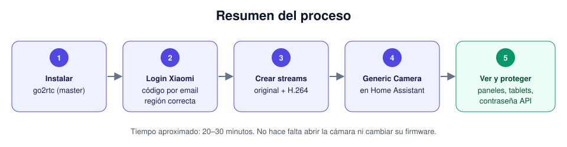

# Cámara Xiaomi 360° en directo en Home Assistant (con go2rtc)

Guía paso a paso para ver **en tiempo real** una cámara Xiaomi / Mi Home que no tiene RTSP (en mi caso una `chuangmi.camera.ipc019`) dentro de Home Assistant. No hace falta abrir la cámara ni cambiarle el firmware.

> **Resumen:** el complemento **go2rtc** incluye una fuente `xiaomi` que habla el mismo protocolo que la app Mi Home. go2rtc se conecta a la cámara **dentro de tu red local**, la convierte en un stream RTSP normal y Home Assistant lo muestra con la integración **Generic Camera**.



---

## Índice

1. [El problema](#1-el-problema)
2. [Requisitos](#2-requisitos)
3. [Paso 1 – Instalar go2rtc](#paso-1--instalar-go2rtc)
4. [Paso 2 – Iniciar sesión con tu cuenta Xiaomi](#paso-2--iniciar-sesión-con-tu-cuenta-xiaomi)
5. [Paso 3 – Crear los streams](#paso-3--crear-los-streams)
6. [Paso 4 – Añadir la cámara a Home Assistant](#paso-4--añadir-la-cámara-a-home-assistant)
7. [Paso 5 – Verla en paneles y tablets](#paso-5--verla-en-paneles-y-tablets)
8. [Paso 6 – Proteger go2rtc](#paso-6--proteger-go2rtc)
9. [Solución de problemas](docs/solucion-de-problemas.md)
10. [Referencias](#referencias)

---

## 1. El problema

Mucha gente en foros no consigue ver estas cámaras en directo en Home Assistant. Estos son los motivos:



- **Xiaomi Miot** (HACS) solo consigue un enlace de vídeo de la nube. Ese enlace caduca en pocos minutos y muchas veces llega corrupto. Con este modelo hay varios issues abiertos sin solución.
- **Los hacks por tarjeta SD** (los que activan RTSP en la propia cámara) solo sirven con el firmware `3.4.2_0062`. Con firmware 4.x no se puede bajar de versión por SD.
- **El flasheo por UART** existe, pero hay que abrir la cámara, conectar un adaptador serie y asumir el riesgo de dejarla inservible.
- **go2rtc** ([desde la v1.9.13](https://go2rtc.org/internal/xiaomi/)) incluye una fuente nativa para cámaras Mi Home. Esta es la vía que ha funcionado.

### Entorno probado

| Elemento | Versión |
|---|---|
| Home Assistant OS | 18.2 |
| Home Assistant Core | 2026.9.2 |
| go2rtc | complemento **go2rtc (master)**, `1.9.14+dev` |
| Cámara | `chuangmi.camera.ipc019`, firmware `4.3.9_0445` |
| Resultado | Protocolo `cs2+tcp`, vídeo **H.265**, audio **PCMA 16 kHz** |

> ⚠️ **La compatibilidad depende del modelo y del firmware.** Antes de empezar, busca tu modelo en la [lista de cámaras Xiaomi conocidas de go2rtc](https://github.com/AlexxIT/go2rtc/issues/1982). Con la versión estable 1.9.14 hubo reportes de que este modelo no funcionaba ([#2003](https://github.com/AlexxIT/go2rtc/issues/2003)), por eso aquí se usa la versión **master**.

---

## 2. Requisitos

- Home Assistant **OS** o **Supervised**, para poder instalar complementos. Con Home Assistant Container puedes usar la imagen Docker de go2rtc, y el resto de la guía es igual.
- La cámara **ya configurada en la app Mi Home** y funcionando.
- Tu usuario y contraseña de Xiaomi, y acceso al email o teléfono de la cuenta para el código de verificación.
- Home Assistant y la cámara deben poder comunicarse en la red local.
  - Lo ideal es que estén en la misma subred.
  - Si usas VLANs o aislamiento de clientes en el Wi-Fi (por ejemplo, una red IoT), permite el tráfico entre ellos.
- **Recomendado:** una IP fija para la cámara (reserva DHCP en tu router).
- **Internet:** go2rtc lo necesita para iniciar sesión y obtener las claves de cifrado. El vídeo va por la red local.



---

## Paso 1 – Instalar go2rtc

Home Assistant ya incluye go2rtc internamente, pero sin interfaz web ni opciones de configuración. Por eso instalamos el complemento de su autor (AlexxIT).

1. Ve a **Ajustes → Complementos → Tienda de complementos**. En versiones recientes este apartado se llama **Apps**.
2. Pulsa el menú **⋮** (arriba a la derecha) y elige **Repositorios**.
3. Añade `https://github.com/AlexxIT/hassio-addons` y pulsa **Añadir**. Cierra el diálogo.
4. Recarga la tienda (menú **⋮ → Buscar actualizaciones**) y busca **go2rtc (master)**.
5. Pulsa **Instalar** y, cuando termine, **Iniciar**.
6. Pulsa **Abrir interfaz web**. Se abrirá la interfaz de go2rtc. También puedes entrar en `http://IP_DE_TU_HA:1984`.

> ¿Por qué *master* y no la estable? La fuente `xiaomi` ha recibido muchas correcciones, sobre todo para cámaras antiguas con protocolo TUTK, que aún no han llegado a la versión estable. Si tu cámara ya funciona con la estable, usa la estable.

En el registro del complemento deberías ver algo así:

```text
INF go2rtc platform=linux/amd64 revision=c245815 version=1.9.14+dev.c245815
INF [rtsp] listen addr=:8554
INF [api] listen addr=:1984
```

---

## Paso 2 – Iniciar sesión con tu cuenta Xiaomi

1. En la interfaz web de go2rtc, entra en la pestaña **Add**.
2. Despliega la sección **Xiaomi**.
3. Escribe tu usuario (email o teléfono) y tu contraseña de Xiaomi y pulsa el botón de login.
4. Xiaomi te enviará un **código de verificación**. Introdúcelo en cuanto llegue, porque caduca rápido. Si aparece un captcha, resuélvelo.
5. Tras el login aparece tu cuenta y un desplegable de **región**, que por defecto está en **China**. **Cámbialo a la región donde está registrada tu cuenta en Mi Home.** En España y el resto de Europa es **Europe**.
6. Pulsa **load devices**. Verás tus dispositivos con una URL como esta:

   ```text
   xiaomi://<ID_CUENTA>:de@<IP_CAMARA>?did=<DEVICE_ID>&model=chuangmi.camera.ipc019
   ```

7. Copia la URL de la cámara. Si también aparecen otros aparatos, como comederos o enchufes, ignóralos.

> 💡 Si el login da `context deadline exceeded (Client.Timeout exceeded while awaiting headers)`, los servidores de Xiaomi han tardado en responder. Espera un minuto y repite el proceso. Si usas AdGuard o Pi-hole, comprueba que no bloquean dominios `*.mi.com`. Más detalles en [solución de problemas](docs/solucion-de-problemas.md).

---

## Paso 3 – Crear los streams

Abre la pestaña **Config** de go2rtc. Allí se edita `go2rtc.yaml`. Tras el login verás que ya existe una sección `xiaomi:` con tu token: **no la toques**. Añade lo siguiente (tienes un ejemplo completo en [`examples/go2rtc.yaml`](examples/go2rtc.yaml)):

```yaml
streams:
  # Stream original de la cámara (H.265 + audio)
  entrada:
    - xiaomi://<ID_CUENTA>:de@<IP_CAMARA>?did=<DEVICE_ID>&model=chuangmi.camera.ipc019

  # Copia convertida a H.264 para navegadores/tablets que no soportan H.265
  entrada_h264:
    - ffmpeg:entrada#video=h264

# Mantiene la conexión con la cámara abierta: el directo arranca al instante
preload:
  entrada:
```

Guarda y **reinicia el complemento**.

### ¿Para qué sirve cada stream?

- **`entrada`** es el vídeo original de la cámara, sin tocar. Esta cámara emite en **H.265**. Safari/iOS lo reproduce, pero muchos navegadores Android, tablets de pared y algunos Chrome no.
- **`entrada_h264`** usa `ffmpeg` para recodificar a **H.264**, que funciona en cualquier sitio. El precio es algo de CPU mientras alguien lo está viendo y que se pierde el audio. `ffmpeg` solo se ejecuta cuando hay alguien mirando.
- **`preload`** mantiene abierta la conexión P2P con la cámara. Sin él, cada vez que abres la cámara hay que negociar la conexión de nuevo y tarda varios segundos.

### Comprobación

En la pestaña **Streams**, pulsa **stream** en `entrada`. Deberías ver el vídeo en directo. Haz lo mismo con `entrada_h264`, que tarda unos segundos más en arrancar.

También puedes abrir en el navegador:

```text
http://IP_DE_TU_HA:1984/api/frame.jpeg?src=entrada
```

y debería devolverte una foto actual de la cámara.

> ⚠️ **Si creas los streams desde la API HTTP de go2rtc** en lugar de desde el editor, codifica bien la URL. Los caracteres `#` y `&` hay que escaparlos (`%23`, `%26`). Si no, `#video=h264` o `&model=...` se pierden sin avisar, y el stream H.264 falla con `exit status 183`.

---

## Paso 4 – Añadir la cámara a Home Assistant

1. Ve a **Ajustes → Dispositivos y servicios → Añadir integración**.
2. Busca **Generic Camera** (en español puede aparecer como *Cámara genérica*).
3. Rellena el formulario:

   | Campo | Valor |
   |---|---|
   | URL de imagen fija | `http://127.0.0.1:1984/api/frame.jpeg?src=entrada` |
   | Fuente de stream | `rtsp://127.0.0.1:8554/entrada_h264` |
   | Protocolo de transporte RTSP | `TCP` |
   | Autenticación | `basic`, sin usuario ni contraseña |
   | Verificar certificado SSL | desactivado |
   | Frecuencia de imagen | `2` |

   Usa `127.0.0.1` porque el complemento go2rtc comparte red con Home Assistant OS. Si go2rtc está en otra máquina, pon su IP.

4. Pulsa **Enviar** y confirma la vista previa.
5. En la entidad nueva (`camera.127_0_0_1` o similar), pulsa el engranaje:
   - Cambia el **ID de entidad** a algo legible, por ejemplo `camera.entrada`.
   - Ponle nombre.
   - Asígnale un área.

> 💡 **Si el formulario se queda cargando y da error la primera vez:** Home Assistant prueba el stream al guardar, y el stream H.264 tarda unos segundos en arrancar. Vuelve a intentarlo, o deja la *Fuente de stream* en `rtsp://127.0.0.1:8554/entrada` y cámbiala a `entrada_h264` después desde **Configurar**.

¿Solo usas iPhone/Safari? Puedes apuntar la *Fuente de stream* directamente a `entrada`. Así ahorras CPU y conservas el audio.

---

## Paso 5 – Verla en paneles y tablets

### En un dashboard

Añade una tarjeta **Imagen de entidad** (`picture-entity`) con vista en directo:

```yaml
type: picture-entity
entity: camera.entrada
camera_view: live
show_state: false
```

### Desde el apartado Medios

Home Assistant muestra todas las cámaras en **Medios → Cámara**. Es útil en tablets de pared, porque no necesitas crear ningún panel.

### Si ocultas elementos de la barra lateral (Custom Sidebar)

Si usas [Custom Sidebar](https://github.com/elchininet/custom-sidebar) para ocultar **Medios** a usuarios no administradores (tablets, kioscos), vuelve a mostrarlo en la excepción correspondiente. Ejemplo completo en [`examples/custom-sidebar-config.yaml`](examples/custom-sidebar-config.yaml):

```yaml
exceptions:
  - is_admin: false
    extend_from: base
    order:
      - item: Medios
        hide: false   # antes: true
```

Después recarga el navegador o la app de la tablet (o reiníciala) para que lea la configuración nueva.

---

## Paso 6 – Proteger go2rtc

Por defecto la API de go2rtc (puerto **1984**) **no tiene contraseña**, y en su configuración se guarda el **token de tu cuenta Xiaomi**. Cualquiera en tu red podría ver las cámaras o leer ese token.

Añade autenticación en `go2rtc.yaml`:

```yaml
api:
  username: "elige_un_usuario"
  password: "elige_una_contraseña_larga"
```

Según la [documentación de go2rtc](https://github.com/AlexxIT/go2rtc/blob/master/internal/api/README.md), las peticiones desde `localhost` **no piden contraseña** salvo que actives `local_auth: true`. Por eso la Generic Camera con `127.0.0.1` sigue funcionando sin cambios.

Otras recomendaciones:

- No abras los puertos 1984, 8554 ni 8555 a Internet. Para ver la cámara desde fuera usa el acceso remoto de Home Assistant (Nabu Casa, VPN…).
- Cuando la versión estable de go2rtc incluya las correcciones que necesita tu cámara, pásate a ella.

---

## Referencias

- [go2rtc – fuente Xiaomi Mi Home](https://go2rtc.org/internal/xiaomi/)
- [go2rtc – lista de cámaras Xiaomi conocidas (#1982)](https://github.com/AlexxIT/go2rtc/issues/1982)
- [go2rtc – soporte TUTK y `chuangmi.camera.ipc019` (#2003)](https://github.com/AlexxIT/go2rtc/issues/2003)
- [go2rtc – `chuangmi.camera.ipc019e` con la versión dev (#2273)](https://github.com/AlexxIT/go2rtc/issues/2273)
- [go2rtc – configuración de la API](https://github.com/AlexxIT/go2rtc/blob/master/internal/api/README.md)
- [Complementos de AlexxIT para Home Assistant](https://github.com/AlexxIT/hassio-addons)
- [hass-xiaomi-miot – vídeo incorrecto en ipc019 (#2625)](https://github.com/al-one/hass-xiaomi-miot/issues/2625)
- [Hack SD para MJSXJ05CM (requiere firmware 3.4.2_0062)](https://github.com/cmiguelcabral/mjsxj05cm-hacks)
- [No es posible bajar desde firmware 4.x por SD (#65)](https://github.com/telmomarques/xiaomi-360-1080p-hacks/issues/65)
- [Hacks por UART para cámaras Xiaomi 360](https://github.com/tsunglung/xiaomi-360-hacks)

---

## Licencia

Documentación publicada bajo licencia [MIT](LICENSE). No tiene relación con Xiaomi, Home Assistant ni go2rtc. Úsala bajo tu responsabilidad.
